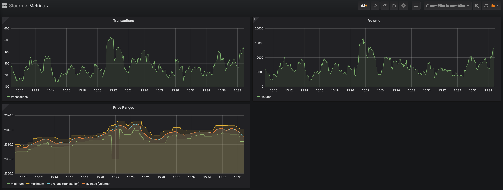

# stock-up
Polls information about stocks to generate actions.

## Introduction
Running the associated services will produce metrics and visualize them in Grafana.



## Setup
Turn on service dependencies.
```bash
docker-compose up -d zookeeper kafka influxdb grafana
```

Configure `kafka`.
```bash
docker exec -it stock-up_kafka_1 bash
kafka-configs.sh --bootstrap-server kafka:9092 --entity-type topics --entity-name stock-quotes --alter --add-config retention.ms=86400000

# The line below should output something like this:
#
# Topic: stock-quotes
#     PartitionCount: 1
#     ReplicationFactor: 1
#     Configs: segment.bytes=1073741824,retention.ms=86400000
kafka-topics.sh --bootstrap-server kafka:9092 --describe --topics-with-overrides
```

Configure `influxdb`.
```bash
docker exec -it stock-up_influxdb_1 bash
influx
CREATE DATABASE "stock" WITH DURATION 7d NAME "stock_rp"
```

Start consuming from the Kafka topic.
```bash
docker-compose up -d stock-analyzer
```

Start generating stock quotes.
```bash
docker-compose up -d stock-query
```

## Setup rabbitmq
`rabbitmq` can be used as an alternative to `kafka`, for the types of message queueing that this application is using.

Turn on service.
```bash
docker-compose up -d rabbitmq
```

Configure `rabbitmq`. See architectures [notes](doc/architecture/rabbitmq).
```bash
docker exec -it stock-up_rabbitmq_1 bash
rabbitmqctl add_user stock-query rmq-password
rabbitmqctl set_permissions -p stocks stock-query ".*" ".*" ".*"
```

## Known Issues
* The websocket occasionally closes the connection (for reasons currently unknown), requiring the connection to be
  restarted. Unfortunately, this still takes a few seconds so we lose at least a few seconds worth of data.
* If the stock analyzer service dies, then all state required to maintain the time windows is also lost. A minimum of
  60 seconds (configurable) is required to restore accurate metrics.
* If the stock query service dies, a manual restart is needed and a permanent loss of data is incurred during the
  downtime.
