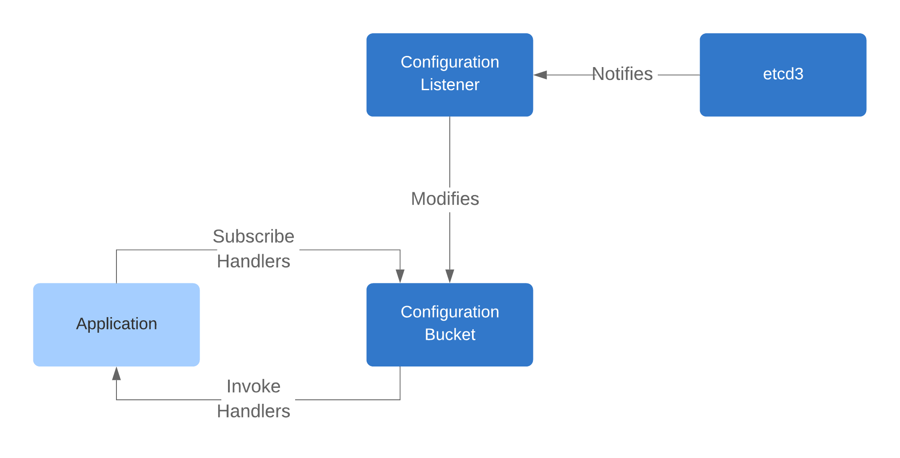

## Design Considerations

### Static
Using static configuration is the default, and can be easily done by providing environment variables to containers
prior to running an application. Any configuration changes require an application restart to re-read the environment.

If the deployment is properly orchestrated, environment changes are typically delivered by committing changes to a
configuration file within the repository, then having continuous delivery perform an upgrade to the deployment version
without service impact. Depending on the build cycle, this might take up to an hour. If the deployment isn't properly
orchestrated, having to restart containers will lead to downtime.

We can summarize the negative impact as:
* potentially lengthy deployment cycle not conducive to rapid changes
* loss of service counter metrics  

To conclude, static configuration is likely not suitable for some use cases, such as fine-grained control of feature
flags, tunable logging, rapid feedback (traffic routing), and rapid recovery.

### Dynamic
The above uses cases can all be enabled with dynamic configuration and a watch-driven design where changes to
configuration notify the application and allow it to adjust its operations. This does, however, require some level of
development discipline because we have to be conscious of dynamic configuration and frequently asking for its current
value. This can be abstracted through the use of good client libraries.

There are several services that we can use to synchronize dynamic configuration, including:
* [Apache ZooKeeper](https://zookeeper.apache.org/)
* [etcd](https://etcd.io/)

### Use Cases
Some concrete use cases of dynamic configuration for this application include:
* defining subscriptions
* defining statistical thresholds and intervals
* defining resource names (hosts, queues, topics, etc.)
* defining logging levels (to assist in debugging)

### Implementation
* generate a base path for the keys of a given application
* watch all child keys of the base path
* application receives key updates through callbacks
* application makes frequent requests for current key value and caches value in memory or to a persistent store

### Handling Application State
From the application's perspective, handling complex configurations such as subscription lists of stock quotes requires
more than one signal. When the list of subscriptions changes, the application must also send those subscriptions
through the websocket channel. If the websocket connection is unexpectedly closed and re-initialized, the application
must also resend all of the requested subscriptions. The current design uses the following components.

#### Configuration Bucket
The configuration bucket is an in-memory store of all configuration changes. It operates as a concurrent data
structure, where the information is expected to be up-to-date as long as the persistent store is available. Non-atomic
operations are always locked to prevent data corruption, as we place a premium on reliability over stability over raw
throughput.

**Interfaces**
* _get_int_: gets the value for a key as an integer
* _get_str_: gets the value for a key as a string
* _update_: updates the value for a key with a version
* _remove_: removes the value for a key
* _subscribe_: registers a callback function that synchronously triggers when changes are made to a specific key
* _unsubscribe_: unregisters a callback function by its subscription ID

**Properties**
* total data size is expected to be negligible (<10 MB)
* reads are expected to happen very frequently (1000+/s)
* writes are expected to happen sparingly (<1/s)

#### Configuration Listener
References and updates the configuration bucket as necessary, handling the complexity of communication with etcd and
seeding initial configuration values correctly.

#### Other Options
The designs below started initially with the concept of a reactor pattern, where all reactors would be predefined and
given to the configuration listener. When a configuration change occurs, the configuration bucket and all reactors are
notified of the change. The configuration bucket receives the latest updates and the reactors have the ability to
implement domain-specific logic for updating the application state.

**Listener passing** is a design where the listener acts as the subscription manager, given how closely the listener
needs to integrate with the stock quote server and the websockets library. Passing it to a potential reactor solves the
dynamic configuration problem while the listener maintains internal state to handle websocket connection resets. The
problem with this design is that a complex object with multiple interfaces is being passed to a reactor, which only
requires a very limited subset of its interfaces. It also requires that the listener be created before the reactor and
that the configuration bucket be stored within the listener. Overall, this approach is functional but violates the
single responsibility principle and is highly unattractive.

**Semaphore passing** is a design that initially creates a semaphore and gives it to all potential reactors as well as
a thread that manages modifies subscriptions. The problem with this design is that it passes around low-level threading
objects that the reactors have to understand. How the subscription manager works with this object is logic that's
internal to the subscription manager but exposed to other services, breaking encapsulation. It also requires that these
threading objects be created before the reactors. Overall, this approach is functional but highly unattractive.

### Articles
[Robinhood: A Simple Implementation of Dynamic Configuration](https://robinhood.engineering/a-simple-implementation-of-dynamic-configuration-71383bcc803b)
