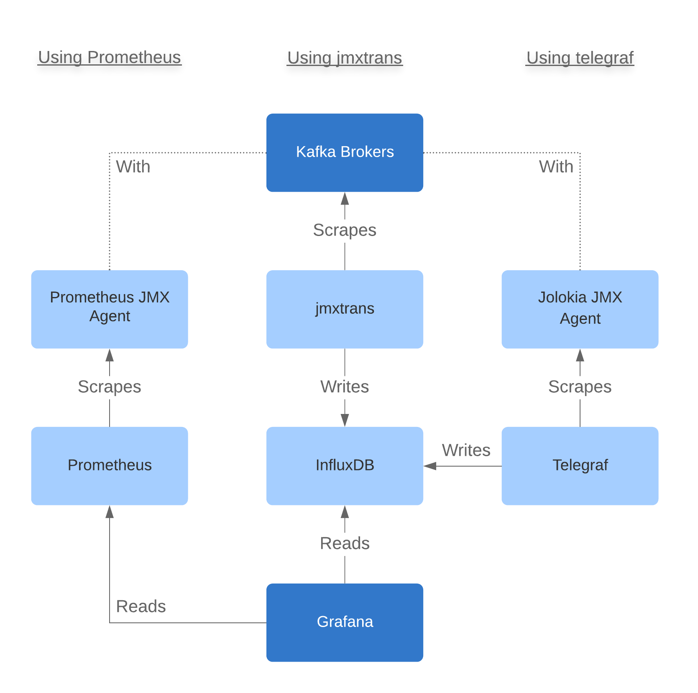

## Design Considerations

### Avoiding Message Duplication
Avoiding duplication is very important for data quality because duplication can result in volume and weighted averages
being calculated incorrectly. Kafka supports deduplication using an `enable.idempotence` configuration in conjunction
with other settings, described [here](https://www.cloudkarafka.com/blog/2019-04-10-apache-kafka-idempotent-producer-avoiding-message-duplication.html).
This results in very simple application development.

### Scaling Throughput
Scaling is typically done by increasing partitions, and consequently, brokers. The difficulty here is that after
scaling, it's conceptually difficult to scale down because of the increase in partitions. There must likely be a
process to drain a partition, delete the partition, and restart brokers. This is much more complicated than setting a
configuration to reduce the consumer count. 

### Monitoring
A few approaches were considered for monitoring operational metrics in Kafka. All of them require some level of
configuration on Kafka brokers to expose JMX metrics.



#### Using Prometheus
This is a very popular option for operational metrics and is also a fairly simple solution, but `Prometheus` as a data
store is very heavily geared towards operational metrics. It uses a pull-based model where applications modify metrics
and an external agent pulls metrics from the application at time intervals. This makes it less convenient for writing
time-series data with arbitrary granularity (based on the application) given the requirement of setting up an agent.
Using InfluxDB is an architectural decision that was already previously made based on those requirements so using
Prometheus here would require setting up and managing an additional time-series data store. Overall, this is a good
default option, if not taking advantage of existing architecture decisions.

#### Using [jmxtrans](https://github.com/jmxtrans/jmxtrans)
This option uses `jmxtrans` and requires the Kafka brokers to expose JMX remotely using additional environment
variables.

```bash
JMX_PORT=9992
KAFKA_JMX_OPTS=-Dcom.sun.management.jmxremote -Dcom.sun.management.jmxremote.authenticate=false -Dcom.sun.management.jmxremote.ssl=false -Djava.rmi.server.hostname=127.0.0.1 -Dcom.sun.management.jmxremote.rmi.port=9992
```

This does not provide direct HTTP access to JMX MBeans but metrics can be viewed using the `jconsole` utility, which
requires JDK. Additional tooling is required view metrics, but the benefit is that few components are required to
produce metrics. Overall, this is a pretty reasonable solution.

#### Using [telegraf](https://github.com/influxdata/telegraf)
This option uses `telegraf`, a pretty popular server agent for collecting metrics in conjunction with `Jolokia`, an
agent that runs alongside Kafka and exposes JMX remotely via HTTP. `Jolokia` can be integrated directly into the Kafka
image with minimal effort.

A key benefit of this implementation is that metrics can be viewed directly using a browser. `telegraf` is also a very
popular agent with support for many types of inputs and outputs. It integrates well with `InfluxDB` and together, they
form two parts of the TICK stack. Overall, this is a pretty good solution.

#### Articles
[Confluent: Monitoring Kafka](https://docs.confluent.io/current/kafka/monitoring.html)
